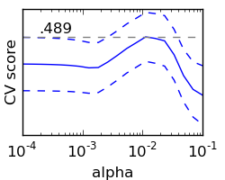

============================================================
Model selection: choosing estimators and their parameters
============================================================

Score, and cross-validated scores
==================================

As we have seen, every estimator exposes a `score` method that can judge
the quality of the fit (or the prediction) on new data. **Bigger is
better**.

::

    >>> from scikits.learn import datasets, svm
    >>> digits = datasets.load_digits()
    >>> X_digits = digits.data
    >>> y_digits = digits.target
    >>> svc = svm.SVC()
    >>> svc.fit(X_digits[:-100], y_digits[:-100]).score(X_digits[-100:], y_digits[-100:])
    0.97999999999999998

To get a better measure of prediction accuracy (which we can use as a
proxy for goodness of fit of the model), we can successively split the
data in *folds* that we use for training and testing::

    >>> import numpy as np
    >>> X_folds = np.array_split(X_digits, 10)
    >>> y_folds = np.array_split(y_digits, 10)
    >>> scores = list()
    >>> for k in range(10):
    ...     # We use 'list' to copy, in order to 'pop' later on
    ...     X_train = list(X_folds)
    ...     X_test  = X_train.pop(k)
    ...     X_train = np.concatenate(X_train)
    ...     y_train = list(y_folds)
    ...     y_test  = y_train.pop(k)
    ...     y_train = np.concatenate(y_train)
    ...     scores.append(svc.fit(X_train, y_train).score(X_test, y_test))
    >>> print scores
    [0.9555555555555556, 1.0, 0.93333333333333335, 0.99444444444444446, 0.98333333333333328, 0.98888888888888893, 0.99444444444444446, 0.994413407821229, 0.97206703910614523, 0.96089385474860334]

This is called a **K-Fold cross-validation**.

Cross-validation generators
=============================

The code above to split data in train and test sets is tedious to write.
The `scikits.learn` exposes cross-validation generators to generate list
of indices for this purpose::

    >>> from scikits.learn import cross_val
    >>> k_fold = cross_val.KFold(n=6, k=3)
    >>> for train_mask, test_mask in k_fold:
    ...      print 'Train: %s | test: %s' % (train_mask, test_mask) 
    Train: [False False  True  True  True  True] | test: [ True  True False False False False]
    Train: [ True  True False False  True  True] | test: [False False  True  True False False]
    Train: [ True  True  True  True False False] | test: [False False False False  True  True]

The cross-validation can then be implemented easily:: 

    >>> kfold = cross_val.KFold(len(X_digits), k=10)
    >>> [svc.fit(X_digits[train], y_digits[train]).score(X_digits[test], y_digits[test])
    ...          for train, test in kfold]
    [0.95530726256983245, 1.0, 0.93296089385474856, 0.98324022346368711, 0.98882681564245811, 0.98882681564245811, 0.994413407821229, 0.994413407821229, 0.97206703910614523, 0.95161290322580649]

To compute the `score` method of an estimator, the scikits.learn exposes
a helper function::

    >>> cross_val.cross_val_score(svc, X_digits, y_digits, cv=kfold, n_jobs=-1)
    array([ 0.95530726,  1.        ,  0.93296089,  0.98324022,  0.98882682,
            0.98882682,  0.99441341,  0.99441341,  0.97206704,  0.9516129 ])

`n_jobs=-1` means that the computation will be dispatched on all the CPUs
of the computer.

   **Cross-validation generators**

.. list-table::

   * 

    - `KFold(n, k)`

    - `StratifiedKFold(y, k)`

    - `LeaveOneOut(n)`

    - `LeaveOneLabelOut(labels)`

   * 

    - Split it K folds, train on K-1, test on left-out

    - Make sure that all classes are even accross the folds

    - Leave one observation out

    - Takes a label array to group observations

.. topic:: **Excercise**
   :class: green

   On the diabetes dataset, plot the cross-validation score of a Lasso
   estimator as a function of alpha (use a logarithmic grid of points,
   from `1e-4` to `1e-1`).

Grid-search and cross-validated estimators
============================================
