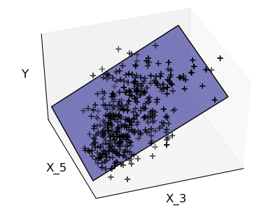
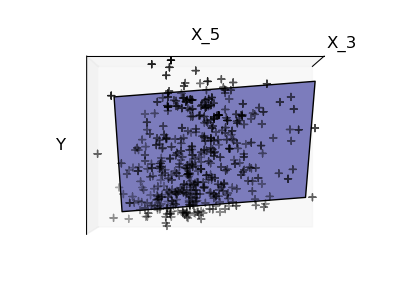
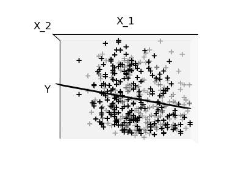

=======================================================================================
Supervised learning: predicting an output variable from high-dimensional observations
=======================================================================================

.. topic:: The problem solved in supervised learning

   Supervised learning consists in learning the link between two
   datasets: the observed data `X`, and an external variable `y` that we
   are trying to predict, usually called `target` or `labels`. Most often, 
   `y` is a 1D array of length `n_samples`. 
   
   All supervised estimators in the scikits.learn implement a `fit(X, y)`
   method to fit the model, and a `predict(X)` method that, given
   unlabeled observations `X`, returns predicts the corresponding labels
   `y`.

.. topic:: Vocabulary: classification and regression

   If the prediction task is to classify the observations in a set of
   finite labels, in other words to "name" the objects observed, the task
   is said to be a **classification** task. On the opposite, if the goal
   is to predict a continous target variable, it is said to be a
   **regression** task.

   In the scikits.learn, for classification tasks, `y` is a vector of
   integers.

Nearest neighbor and the curse of dimensionality
=================================================

.. topic:: Classifying irises:

    The iris dataset is a classification task consisting in identifying 3
    different types of irises (Setosa, Versicolour, and Virginica) from
    their petal and sepal length and width::

        >>> import numpy as np
        >>> from scikits.learn import datasets
        >>> iris = datasets.load_iris()
        >>> X = iris.data
        >>> y = iris.target
        >>> np.unique(y)
        array([0, 1, 2])

k-Nearest neigbhors classifier
-------------------------------

The simplest possible classifier is the nearesr neighbor: given a new
observation `x_test`, find in the training set -the data used to train
the estimator- the observation with the closest feature vector.

.. topic:: Training set and testing set

   When experimenting with learning algorithm, it is important not to
   test the prediction of an estimator on the data used to fit the
   estimator, as this would not be evaluating the performance of the
   estimator on **new data**. This is why datasets are often split into
   *train* and *test* data.

**KNN (k nearest neighbors) classification example**::

    >>> # Split iris data in train and test data
    >>> # A random permutation, to split the data randomly
    >>> np.random.seed(0)
    >>> indices = np.random.permutation(len(X))
    >>> X_train = X[indices[:-10]]
    >>> y_train = y[indices[:-10]]
    >>> X_test  = X[indices[-10:]]
    >>> y_test  = y[indices[-10:]]
    >>> # Create and fit a nearest-neighbor classifier
    >>> from scikits.learn.neighbors import NeighborsClassifier
    >>> knn = NeighborsClassifier()
    >>> knn.fit(X_train, y_train)
    NeighborsClassifier(n_neighbors=5, window_size=1, algorithm='auto')
    >>> knn.predict(X_test)
    array([1, 2, 1, 0, 0, 0, 2, 1, 2, 0])
    >>> y_test
    array([1, 1, 1, 0, 0, 0, 2, 1, 2, 0])

The curse of dimensionality
-------------------------------

If the data is only described by one feature, with values ranging from 0
to 1, with `n` train observations, new data will no further away than
`1/n` and the nearest neighbor decision rule will be efficient as soon as
`1/n` is small compared to the scale of between-class feature variations.

If the number of features is `p`, the number of training samples to pave
the `[0, 1]` space with a between-point distance of `d`, is `1/d**p`.
This number scales exponentialy `p`, the dimensionality of the problem.

In other words, the prediction problem becomes much harder for
high-dimensional data. This is called the **curse of dimensionality** and
is the core problem that machine learning addresses.

Linear model: from regression to sparsity
==========================================

.. topic:: Diabetes dataset

    The diabetes dataset consists of 10 physiological variables (age,
    sex, weight, blood pressure) measure on 442 patients, and an
    indication of disease progression after one year::

        >>> diabetes = datasets.load_diabetes()
        >>> X_train = diabetes.data[:-20]
        >>> X_test  = diabetes.data[-20:]
        >>> y_train = diabetes.target[:-20]
        >>> y_test  = diabetes.target[-20:]
    
    The task at hand is to predict disease prediction from physiological
    variables. 

.. image:: plot_ols_1.png
   :scale: 44
   :align: right

Linear models: :math:`y = \beta X + \epsilon`

 * :math:`X`: data
 * :math:`y`: target variable
 * :math:`\beta`: Coefficients
 * :math:`\epsilon`: Observation noise

:: 

    >>> from scikits.learn import linear_model
    >>> clf = linear_model.LinearRegression()
    >>> clf.fit(X_train, y_train)
    LinearRegression(fit_intercept=True)
    >>> print clf.coef_
    [  3.03499549e-01  -2.37639315e+02   5.10530605e+02   3.27736980e+02
      -8.14131709e+02   4.92814588e+02   1.02848452e+02   1.84606489e+02
       7.43519617e+02   7.60951722e+01]

.. rst-class:: centered

    **Fitting only features 3 and 5**

    |diabetes_ols_diag| |diabetes_ols_x2| |diabetes_ols_x1| 

We can see that although feature 5 has a strong coefficient on the full
model, it conveys little information on `y` when considered only with
feature 3.

.. note::

   A representation of the full diabetes dataset would involve 11
   dimensions (10 feature dimensions, and one of the target variable). It
   is hard to develop an intuition on such representation, but it may be
   useful to keep in mind that it would be a fairly *empty* space.

Support vector machines
========================

Gaussian process: introducing the notion of posterior estimate
===============================================================

