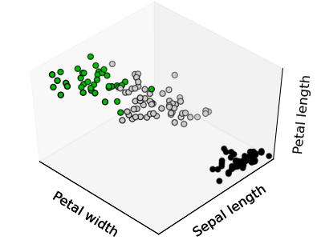

============================================================
Unsupervised learning: seeking representations of the data
============================================================

Clustering: grouping observations together
============================================

.. topic:: The problem solved in clustering

    Given the iris dataset, if we knew that there were 3 types of iris, but
    did not have access to a taxonomist to label them: we could try a
    **clustering task**: split the observations in well-separated group
    called *clusters*.

..   
   See the PRNG   
   >>> import numpy as np
   >>> np.random.seed(1)

K-means clustering
-------------------

Note that their exists many different clustering criteria and associated
algorithm. The simplest clustering algorithm is the k-means.

:: 

    >>> from scikits.learn import cluster, datasets
    >>> iris = datasets.load_iris()
    >>> X_iris = iris.data
    >>> y_iris = iris.target

    >>> k_means = cluster.KMeans(k=3)
    >>> k_means.fit(X_iris) # doctest: +ELLIPSIS
    KMeans(verbose=0, k=3, max_iter=300, init='k-means++',...
    >>> print k_means.labels_[::10]
    [1 1 1 1 1 0 0 0 0 0 2 2 2 2 2]
    >>> print y_iris[::10]
    [0 0 0 0 0 1 1 1 1 1 2 2 2 2 2]

.. |k_means_iris_bad_init| image:: k_means_iris_bad_init.png
   :scale: 63

.. |k_means_iris_8| image:: k_means_iris_8.png
   :scale: 63

.. |cluster_iris_truth| image:: cluster_iris_truth.png
   :scale: 63

.. warning:: 
   
    There is absolutely no garanty of recovering a ground truth. First
    choosing the right number of clusters is hard. Second, the algorithm
    is sensitive to initialization, and can fall in local minima,
    although in the `scikits.learn` we play many tricks to mitigate this
    issue.

    .. list-table::
        :class: centered
        
        * 
        
            - |k_means_iris_bad_init|

            - |k_means_iris_8|

            - |cluster_iris_truth|

        * 
        
            - **Bad initialization**
            
            - **8 clusters**
            
            - **Ground truth**

    **Don't over-interpret clustering results**

.. |lena| image:: lena.png
   :scale: 30

.. |lena_regular| image:: lena_regular.png
   :scale: 30

.. |lena_compressed| image:: lena_compressed.png
   :scale: 30

.. |lena_histogram| image:: lena_histogram.png
   :scale: 40

.. topic:: **Application example: vector quantization**

    Clustering in general and KMeans in particular, can be seen as a way
    of choosing a small number of examplars to compress the information,
    a problem sometimes known as vector quantization. For instance, this
    can be used to posterize an image::

    >>> import scipy as sp
    >>> lena = sp.lena()
    >>> X = lena.reshape((-1, 1)) # We need an (n_sample, n_feature) array
    >>> k_means = cluster.KMeans(k=5, n_init=1)
    >>> k_means.fit(X)
    >>> values = k_means.cluster_centers_.squeeze()
    >>> labels = k_means.labels_
    >>> lena_compressed = np.choose(labels, values)
    >>> lena_compressed.shape = lena.shape

    .. list-table::
      :class: centered 

      *
        - |lena|

        - |lena_compressed|

        - |lena_regular|

        - |lena_histogram|

      *

        - Raw image

        - K-means quantization

        - Equal bins

        - Image histogram

Hierarchical clustering: Ward
------------------------------

For estimating a large number of clusters, top-down approaches are both
statisticaly ill-posed, and slow. Hierarchical clustering is a bottom-up
approach that merges successively observations together and is
particularly useful when the clusters of interest are made of only a few
observations. *Ward* clustering minimize a criterion similar to k-means
in a bottom-up approach. When the number of clusters is large, it is much
more computationally efficient then k-means.

Decompositions: from a signal to components and loadings
===========================================================

